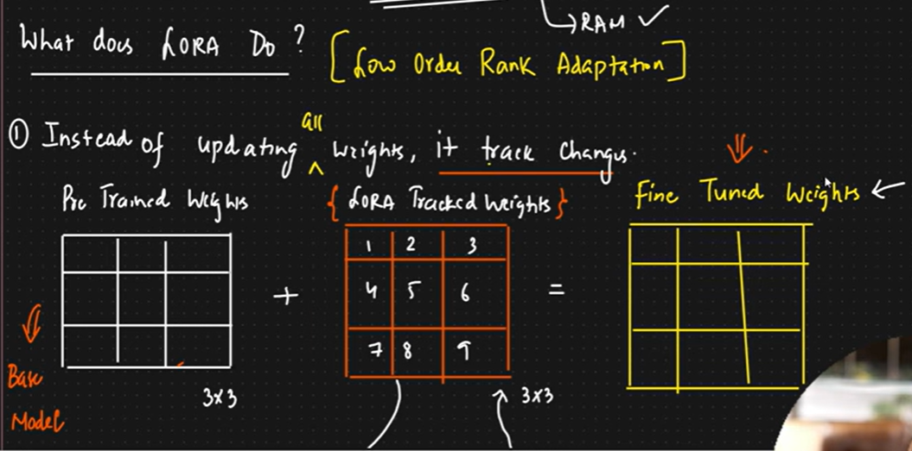

There are two methods of fine tuning
1) LoRA & QLoRA
LoRA (lower order rank adaptation)
QLoRA( Quantized lower order rank adaptation)

Full parameter fine tuning and domain specific fine tuning

Full parameter fine tuning - not much reliable hardware constraints etc..

What does LoRA do ?

-> Instead of updating weights , it traces changes
it gives the rank in the matrices
and them sets them according to low rank order matrcies eventually we get the fine tuned matrice

Instead of training the entire model and all of the pre-trained weights, they are set aside or “frozen” and a smaller sample size of parameters is trained instead. These sample sizes are called “low-rank” adaptation matrices, for which LoRA is named.

They are called low-rank because they are matrices with a low number of parameters and weights. Once trained, they are combined with the original parameters, and then act as one single matrix. This allows fine-tuning to be done much more efficiently.

When the new low-rank parameters have been trained, the single “row” or “column” is added into the original matrix. This allows it to apply its new training to the whole parameter.

# Steps of fine tuning through code (Google Colab):

1. setting up the virtual machine (downloading dependencies)
2. Loading the Model from hugging face
    model, tokenizer = FastLanguageModel.from_pretrained(
    model_name = "unsloth/Qwen2.5-1.5B-Instruct-bnb-4bit",
    max_seq_length = max_seq_length,
    dtype = dtype,
    load_in_4bit = load_in_4bit, # True
)
3. setting up LoRA using .FastLanguageModel.get_peft_model() ( getting parameter efficient fine tune model and setting ranks etc..)
4. formatting the dataset ( training on the dataset) # most important step , because every time in fine tuning mostly all steps remain same,   just change of dataset can make diffrent outputs in fine tuning 
5. So after loading the dataset , now we have to train it on the dataset using trainer.train()
6. Then we can upload it on hugging face.

moreover we use diffrent models for training for diffrent use cases 

